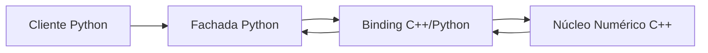

# Guia Técnico e de Coordenação — Workshop C++ e Python

> **Escopo:** refatoração, integração entre C++ e Python e qualidade de código  
> **Duração:** 120 minutos  
> **Público:** equipes com conhecimentos básicos ou intermediários de C++ e Python

## 1. Objetivo

Conduzir uma atividade prática na qual duas equipes evoluem uma biblioteca de cálculo numérico, preservando seu comportamento e melhorando clareza, modularidade e integração.

O núcleo numérico fica sob responsabilidade do time C++. A interface de uso, validação e testes fica sob responsabilidade do time Python.

A atividade deve desenvolver quatro competências:

- identificar *code smells* e dívida técnica;
- refatorar sem alterar o comportamento esperado;
- integrar C++ e Python por meio de um módulo nativo;
- usar análise estática, testes e métricas para orientar decisões.

## 2. Escopo funcional

O projeto cobre três domínios matemáticos:

1. convergência e divergência de séries numéricas;
2. integração numérica de funções;
3. aproximação por polinômios de Taylor.

Cada domínio deve possuir contrato claro, responsabilidade única e testes independentes.

Detalhes algorítmicos, assinaturas definitivas e escolhas de otimização devem ser acordados pelos times durante a definição dos contratos.

## 3. Arquitetura de referência

A solução deve seguir uma arquitetura em camadas:



### Camada Python

Responsável pela API pública, validação de entradas, tradução da experiência de uso e testes comportamentais.

### Camada de integração

Responsável pelo contrato entre as linguagens, conversão de tipos e propagação consistente de erros.

### Núcleo C++

Responsável pelos cálculos numéricos, desempenho, precisão e regras matemáticas centrais.

## 4. Decisão de integração

A integração principal deve usar FFI *in-process* com `pybind11`.

Essa escolha reduz infraestrutura, evita comunicação por rede e mantém o foco da atividade em refatoração, contratos e qualidade.

`gRPC`, `ZeroMQ`, `ctypes`, `cppyy` e `nanobind` podem ser citados como alternativas, mas não fazem parte da implementação prevista.

O build integrado deve usar `CMake` e `scikit-build-core`, produzindo um pacote Python capaz de carregar o módulo nativo.

## 5. Princípios e padrões de projeto

### Fachada

A API Python deve ser o único ponto público de acesso. Consumidores não devem depender diretamente dos detalhes do módulo nativo.

### Adaptador

A camada de binding deve adaptar tipos e erros entre Python e C++, sem concentrar regras matemáticas ou regras de apresentação.

### Estratégia

Algoritmos intercambiáveis devem compartilhar contratos equivalentes. A escolha de um método não deve exigir alteração na camada consumidora.

### Funções puras

Rotinas numéricas devem depender somente das entradas recebidas. Estado global e efeitos colaterais devem ser evitados.

### Guard clauses

Validações devem falhar cedo e com mensagens claras. Condicionais profundas devem ser substituídas por verificações diretas quando isso melhorar a leitura.

### RAII

Recursos nativos devem possuir ciclo de vida determinístico. Gerenciamento manual e ambíguo de recursos deve ser evitado.

### Separação de responsabilidades

Validação de uso pertence à fachada Python. Regras matemáticas e cálculo pertencem ao núcleo C++. Conversão entre linguagens pertence ao binding.

## 6. Contratos entre os times

Antes da implementação, os times devem acordar:

- nomes e objetivos das operações públicas;
- tipos de entrada e saída;
- unidades, limites e tolerâncias;
- representação de sucesso, divergência e erro;
- exceções expostas ao usuário Python;
- critérios numéricos usados nos testes;
- responsabilidade por cada validação.

Mudanças nesses contratos exigem alinhamento entre os dois times antes da integração.

Falhas silenciosas e valores sentinela não devem representar erros. Erros devem ser explícitos, documentados e testáveis.

## 7. Responsabilidades

### Time C++

- definir contratos do núcleo numérico com o time Python;
- organizar os módulos matemáticos;
- garantir precisão, segurança e eficiência;
- implementar e manter os bindings;
- corrigir alertas relevantes de `clang-tidy`;
- documentar premissas e limites matemáticos.

### Time Python

- definir a API pública com o time C++;
- validar entradas na fronteira da aplicação;
- manter a fachada desacoplada do binding;
- criar testes nominais, de borda e de erro;
- corrigir alertas relevantes do `Ruff`;
- documentar comportamento visível ao consumidor.

### Responsabilidades compartilhadas

- aprovar contratos de integração;
- manter o build reproduzível;
- executar testes após cada refatoração;
- revisar mudanças que cruzem a fronteira C++/Python;
- acompanhar métricas sem substituir revisão humana por pontuação.

### Professor ou host

- preparar e validar o ambiente antes da sessão;
- coordenar acessos e turnos de edição;
- mediar decisões de contrato;
- conduzir checkpoints;
- garantir que a atividade permaneça dentro do escopo.

## 8. Ferramentas

| Ferramenta | Uso | Responsável principal |
|---|---|---|
| C++17 | Núcleo numérico | Time C++ |
| Python 3.10+ | Fachada e validação | Time Python |
| pybind11 | Integração nativa | Ambos |
| CMake | Build do código C++ | Time C++ |
| scikit-build-core | Integração do build com o pacote Python | Ambos |
| pytest | Testes comportamentais e de regressão | Time Python |
| clangd | Diagnóstico C++ no editor | Time C++ |
| clang-tidy | Análise estática C++ | Time C++ |
| Ruff | Lint e formatação Python | Time Python |
| CodeScene | Apoio à análise de manutenibilidade | Ambos |
| VS Code Live Share | Colaboração síncrona | Host e equipes |
| Git | Histórico, isolamento e revisão das mudanças | Ambos |

Ferramentas devem apoiar decisões técnicas. Correções automáticas só devem ser aceitas quando preservarem contratos e comportamento.

## 9. Estrutura e fronteiras do repositório

```text
math-calculus-project/
├── CMakeLists.txt
├── pyproject.toml
├── cpp/
│   ├── include/
│   │   ├── series.hpp
│   │   ├── integration.hpp
│   │   └── taylor.hpp
│   ├── src/
│   │   ├── series.cpp
│   │   ├── integration.cpp
│   │   └── taylor.cpp
│   └── bindings.cpp
├── python/
│   └── mathlab/
│       ├── __init__.py
│       └── api.py
└── tests/
    ├── test_series.py
    ├── test_integration.py
    └── test_taylor.py
```

`cpp/` pertence ao núcleo e à integração nativa. `python/mathlab/` pertence à API pública. `tests/` valida o comportamento observado pelo consumidor Python.

Arquivos de build são compartilhados. Mudanças neles exigem revisão cruzada.

## 10. Fluxo de trabalho

1. **Alinhamento:** apresentar objetivos, arquitetura, contratos e métricas.
2. **Linha de base:** executar build, testes e análises antes das mudanças.
3. **Refatoração inicial:** cada time atua em sua área sem alterar contratos.
4. **Checkpoint:** comparar comportamento, alertas e legibilidade.
5. **Integração:** revisar em conjunto mudanças na fronteira entre linguagens.
6. **Validação final:** repetir build, testes e análises.
7. **Retrospectiva:** registrar ganhos, limites e decisões técnicas.

Refatorações devem ser pequenas, revisáveis e validadas continuamente. Testes não devem ser removidos ou enfraquecidos para permitir uma mudança.

## 11. Estratégia de qualidade

### Testes

A suíte deve cobrir comportamento nominal, limites relevantes e erros previstos para cada domínio matemático.

Testes devem verificar contratos públicos, não detalhes internos. Comparações numéricas devem usar tolerâncias documentadas e coerentes com o método avaliado.

### Análise estática

`clang-tidy` e `Ruff` devem detectar riscos, inconsistências e complexidade desnecessária. Alertas críticos devem ser resolvidos antes da entrega.

### Métricas de manutenibilidade

Code Health pode comparar o estado inicial e final. A métrica serve como evidência auxiliar, não como objetivo isolado.

### Revisão cruzada

Toda mudança em tipos, erros ou operações expostas deve receber revisão dos dois times.

## 12. Documentação mínima

Cada operação pública deve documentar:

- finalidade;
- entradas e saídas;
- condições de erro;
- limites e premissas numéricas;
- tolerância esperada, quando aplicável.

Decisões arquiteturais relevantes devem registrar contexto, decisão, justificativa e consequências.

Comandos de build, análise e teste devem permanecer centralizados na documentação do projeto ou nas tarefas do editor.

## 13. Critérios de aceitação

A atividade estará concluída quando:

- o pacote puder ser construído no ambiente do host;
- a API Python acessar o núcleo C++ somente pela camada de integração;
- os três domínios possuírem contratos claros e testes independentes;
- todos os testes automatizados passarem;
- não houver falhas silenciosas;
- alertas críticos de `clang-tidy` e `Ruff` estiverem resolvidos;
- responsabilidades entre os times estiverem respeitadas;
- mudanças de contrato estiverem documentadas e revisadas;
- a equipe conseguir explicar as principais refatorações e seus efeitos.

## 14. Fora de escopo

Não fazem parte desta atividade:

- comunicação distribuída por IPC ou rede;
- interfaces gráficas;
- persistência de dados;
- otimizações sem evidência de necessidade;
- expansão para novos domínios matemáticos;
- automação de implantação em produção.

Esses itens só devem ser considerados após conclusão e validação do escopo principal.
