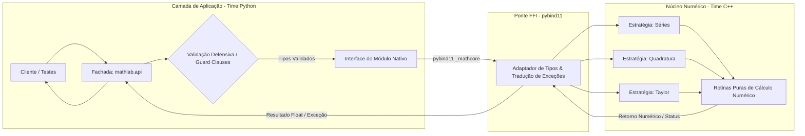

# OBJECTIVE.md — Guia Técnico e Coordenação (Dinâmica de 2h)

> **Escopo:** Workshop Prático de Refatoração, Integração FFI (C++ ↔ Python) e Qualidade de Código  
> **Duração:** 120 minutos (2 horas)  
> **Público:** Equipes de Desenvolvimento C++ (Núcleo Numérico) e Python (API, Validação & Testes)

---

## 1. Visão Geral e Objetivo da Dinâmica

O propósito deste laboratório prático é guiar duas equipes multidisciplinares (C++ e Python) na construção e refatoração colaborativa de uma biblioteca modular de cálculo numérico.

A dinâmica é estritamente delimitada a **120 minutos**, focando em boas práticas de engenharia de software, design patterns, erradicação de *code smells* e verificação contínua da qualidade, concentrando-se em três temas matemáticos essenciais:

1. **Convergência e Divergência de Séries Numéricas**
2. **Integrador Numérico de Funções**
3. **Aproximação por Polinômio de Taylor**



---

## 2. Registro de Decisão Arquitetural (ADR-001: Integração FFI vs. IPC)

- **Contexto:** Necessidade de integrar um núcleo computacional de alta performance em C++ com uma camada expressiva de validação e testes em Python durante uma sessão de 2 horas.
- **Decisão:** Adoção de **FFI in-process** via **pybind11** com backend de compilação **scikit-build-core** e **CMake**.
- **Justificativa:**
  - *Desempenho:* Chamadas no mesmo espaço de endereçamento de memória, sem latência de sockets de rede ou serialização de dados.
  - *Simplicidade Didática:* Geração de um módulo compartilhado único (`_mathcore`) consumível de forma direta pelo Python.
  - *Alternativas Rejeitadas:* Protocolos IPC baseados em rede (gRPC ou ZeroMQ) foram descartados pela sobrecarga de definição de esquemas de mensagens (`.proto`), compilação de stubs e gerenciamento de processos paralelos, inviáveis para a restrição temporal de 120 minutos. Wrappers manuais em `ctypes` foram descartados pela ausência de verificação de tipos em tempo de compilação e suporte deficiente a exceções de C++.

---

## 3. Contrato de Layout de Memória e Gestão de Recursos

Para assegurar estabilidade e desempenho sem overheads desnecessários:

- **Alinhamento e Tipos Primitivos:** Todos os cálculos numéricos utilizam precisão dupla IEEE 754 (`double` em C++ correspondendo a `float64` no NumPy e `float` nativo do Python).
- **Semântica de Passagem:**
  - Valores escalares (pontos $x, x_0$, limites $a, b$, tolerância $\epsilon$, ordem $n$) são transferidos estritamente **por valor**.
  - Estruturas de dados ou coleções de coeficientes devem ser transmitidas como sequências contíguas em memória (*C-contiguous memory buffer*), acessadas no C++ via referências constantes (`const&`) para garantir ausência de cópias redundantes.
- **Gerenciamento RAII:** Alocações dinâmicas de memória são terminantemente proibidas no fluxo principal das funções de cálculo. O ciclo de vida de qualquer recurso nativo é delimitado por escopo determinístico (RAII).

---

## 4. Padrões de Projeto e Diretrizes Técnicas

As equipes devem estruturar a solução aplicando os seguintes padrões arquiteturais:

- **Facade Pattern (Fachada):** O pacote Python (`mathlab.api`) atua como fachada única de alto nível, ocultando do consumidor final a existência do módulo nativo compilado (`_mathcore`).
- **Strategy Pattern (Estratégia):** Desacoplar os algoritmos numéricos de suas interfaces de chamada, permitindo selecionar dinamicamente métodos matemáticos (por exemplo, método dos trapézios versus regra de Simpson para integração) sem modificar a camada consumidora.
- **Adapter Pattern (Adaptador):** A camada de bindings (`bindings.cpp`) atua como adaptador estrutural, convertendo tipos e contratos de chamada entre o ambiente interpretado Python e as sub-rotinas compiladas C++.
- **Guard Clauses & Early Return:** Na camada Python, validações de domínio, limites e tipos numéricos devem interromper o fluxo imediatamente no início das funções, eliminando condicionais aninhadas (*nested ifs*).
- **Exception Translation (Tradução Estrita de Exceções):** **Proibido o uso de falhas silenciosas** (retorno de valores sentinela como 0.0, -1 ou NaN para sinalizar erro). Cenários matematicamente degenerados ou limites inválidos devem disparar exceções explícitas de C++ (`std::invalid_argument`, `std::runtime_error`), traduzidas automaticamente pela camada de binding para `ValueError` ou `RuntimeError` no Python.
- **Funções Puras:** As rotinas de cálculo numérico no C++ devem ser idempotentes, dependendo exclusivamente dos argumentos fornecidos, sem estado global ou efeitos colaterais.

---

## 5. Matriz de Ferramentas e Responsabilidades Técnicas

| Ferramenta / Tecnologia | Finalidade Técnica no Workshop | Time Responsável |
| :--- | :--- | :--- |
| **C++17** | Implementação algorítmica de precisão e eficiência matemática | Time C++ |
| **pybind11** | Geração do módulo de extensão nativa (`_mathcore`) | Time C++ / Python |
| **CMake & scikit-build-core** | Automação de compilação integrada ao packaging Python | Ambos |
| **Python 3.10+ & NumPy** | Camada de fachada, sanitização de dados e consumo de alto nível | Time Python |
| **pytest** | Testes comportamentais e de regressão da fachada e integração | Time Python |
| **deal lint** | Análise estática de contratos, invariantes e efeitos da camada Python | Time Python |
| **deal prove** | Verificação limitada de contratos Python em funções selecionadas | Time Python |
| **pyright** | Verificação estática de tipos da API Python | Time Python |
| **clang-tidy & clangd** | Análise estática, modernização e prevenção de code smells em C++ | Time C++ |
| **AddressSanitizer & UndefinedBehaviorSanitizer** | Detecção dinâmica de acessos inválidos e comportamento indefinido no C++ | Time C++ |
| **ctest** | Execução de testes registrados pelo CMake | Time C++ |
| **ESBMC** | Verificação formal ou limitada de `src/maximum.cpp` | Time C++ |
| **Ruff** | Linter e formatador de alta performance para Python (complexidade C901) | Time Python |
| **CodeScene** | Monitoramento em tempo real do índice de *Code Health* e complexidade | Ambos |
| **Live Share / p2p-live-share** | Ambiente colaborativo síncrono para pair programming | Ambos |

### 5.1 Protocolo Obrigatório de Verificação

Cada alteração Python deve passar por todos os comandos:

```bash
ruff check .
deal lint
deal prove
pyright
pytest
```

Cada alteração C++ deve passar pela análise estática, pelo build com sanitizers e pelos testes CMake:

```bash
clang-tidy
cmake -S . -B build -DCMAKE_CXX_FLAGS="-fsanitize=address,undefined"
cmake --build build
ctest --test-dir build
```

Componentes C++ selecionados com lógica limitada devem também ser verificados formalmente. A partir de `cpp/`, executar:

```bash
esbmc src/maximum.cpp
```

---

## 6. Fronteiras do Projeto e Estrutura de Diretórios

A estrutura física do repositório delimita claramente o escopo de atuação de cada time:

```text
math-calculus-project/
├── CMakeLists.txt                # Configuração do build C++ / pybind11 (Ambos)
├── pyproject.toml                # Metadados do pacote Python e scikit-build (Ambos)
├── cpp/                          # Escopo exclusivo do Time C++
│   ├── include/
│   │   ├── series.hpp            # Contratos de cabeçalho: Séries Numéricas
│   │   ├── integration.hpp       # Contratos de cabeçalho: Integrador de Funções
│   │   └── taylor.hpp            # Contratos de cabeçalho: Polinômio de Taylor
│   ├── src/
│   │   ├── series.cpp            # Implementação modular de séries
│   │   ├── integration.cpp       # Implementação modular de quadratura
│   │   └── taylor.cpp            # Implementação modular de Taylor
│   └── bindings.cpp              # Exportação pybind11 (_mathcore)
├── python/
│   └── mathlab/                  # Escopo exclusivo do Time Python
│       ├── __init__.py           # Ponto de exportação do pacote
│       └── api.py                # Fachada pública e validações defensivas
└── tests/                        # Escopo exclusivo do Time Python
    ├── test_series.py            # Bateria pytest: Séries
    ├── test_integration.py       # Bateria pytest: Integração
    └── test_taylor.py            # Bateria pytest: Taylor
```

---

## 7. Especificação dos Módulos Matemáticos e Contratos Abstratos

Os módulos foram simplificados para permitir implementação e refatoração completas em 120 minutos:

### 7.1 Módulo 1: Convergência e Divergência de Séries Numéricas

- **Objetivo Matemático:** Avaliar a estabilidade e o comportamento assintótico de uma série numérica $\sum a_n$, computando a soma aproximada até uma tolerância $\epsilon$ com critério de corte em $N_{max}$ termos.
- **Contrato de Interface:**
  - *Entradas:* Parâmetros da série (razão $r$ e termo inicial $a$ para séries geométricas), tolerância $\epsilon > 0$, limite máximo de iterações $N_{max} \ge 1$.
  - *Saídas:* Registro estruturado contendo flag de convergência (`bool`), valor da soma acumulada (`float`) e contagem de iterações executadas (`int`).
  - *Garantias e Exceções:* Parâmetros $\epsilon \le 0$ ou $N_{max} < 1$ disparam erro imediato. Séries com divergência matemática manifesta ($|r| \ge 1$) retornam status explícito de divergência ou disparam exceção controlada, sem laços infinitos.

### 7.2 Módulo 2: Integrador Numérico de Funções

- **Objetivo Matemático:** Determinar o valor aproximado da integral definida $\int_a^b f(x)\,dx$ sobre intervalos contínuos e limitados.
- **Contrato de Interface:**
  - *Entradas:* Seletor da função de teste, limites de integração $a$ e $b$, número de subintervalos $n \ge 1$, seletor da regra de quadratura (`trapezoidal` ou `simpson`).
  - *Saídas:* Valor escalar da integral aproximada (`float`).
  - *Garantias e Exceções:* Intervalos degenerados ($a \ge b$) e contagens de passos inválidas ($n \le 0$) disparam erro imediato. A regra de Simpson exige número par de subintervalos, disparando exceção se violada.

### 7.3 Módulo 3: Aproximação por Polinômio de Taylor

- **Objetivo Matemático:** Calcular o valor aproximado de funções elementares analíticas ($e^x$, $\sin(x)$, $\cos(x)$) em torno de um ponto de expansão $x_0$ com ordem finita $n$:
  $$P_n(x) = \sum_{k=0}^n \frac{f^{(k)}(x_0)}{k!} (x - x_0)^k$$
- **Contrato de Interface:**
  - *Entradas:* Ponto de avaliação $x$, centro de expansão $x_0$, ordem polinomial $n \ge 0$, seletor da função elementar.
  - *Saídas:* Valor escalar correspondente à aproximação polinomial $P_n(x)$ (`float`).
  - *Garantias e Exceções:* Ordem negativa ($n < 0$) ou ordens que excedam o limite de precisão numérica sem estouro ($n > 20$) disparam erro de validação.

---

## 8. Mapeamento de Code Smells e Diretrizes de Refatoração

A refatoração durante o workshop é guiada por objetivos mensuráveis de qualidade:

### 8.1 Time C++ (Núcleo & Bindings)

- **Quebra de Métodos Longos (*Long Method*):** Decompor laços extensos em subfunções coesas e reutilizáveis (por exemplo, isolar a computação do termo $k$-ésimo da soma acumulada).
- **Redução de Complexidade Ciclomática (*Deep Nested Complexity*):** Eliminar laços aninhados excessivos em rotinas de amostragem; atingir redução de complexidade $\ge 30\%$.
- **Eliminação de *Primitive Obsession*:** Agrupar conjuntos correlacionados de parâmetros de configuração em estruturas leves ou registros nomeados.
- **Erradicação de Falhas Silenciosas:** Substituir quaisquer retornos sentinela por lançamentos explícitos de `std::invalid_argument` ou `std::runtime_error`.

### 8.2 Time Python (API, Validação & Testes)

- **Eliminação de Condicionais Aninhadas (*Complex Conditionals* & *Nested Ifs*):** Substituir blocos de validação aninhados por *guard clauses* imediatas com retorno antecipado.
- **Tipagem Estática Completa:** Assegurar anotações de tipo (*type hints*) em todas as funções públicas da API.
- **Garantia de Cobertura via pytest:**
  - *Cenários Nominais:* Validação de resultados matemáticos conhecidos analiticamente com tolerâncias rigorosas (`math.isclose` ou `numpy.isclose`).
  - *Cenários de Borda:* Avaliação com passos unitários e limites mínimos de tolerância.
  - *Cenários de Exceção:* Garantia de captura e asserção de `pytest.raises(ValueError)`.
- **Conformidade de Contratos, Tipos e Linter:** Garantir execução sem violações de `deal lint`, `deal prove`, `pyright` e `Ruff` (sem alertas de complexidade C901 ou simplificação SIM).

---

## 9. Matriz de Atribuição e Handoff (RACI)

| Atividade / Entregável | Time C++ | Time Python | Host (Professor) |
| :--- | :---: | :---: | :---: |
| **Definição dos Contratos de Assinatura FFI** | Responsável | Aprovador | Consultado |
| **Implementação dos Algoritmos Numéricos (C++)** | Responsável | Consultado | Informado |
| **Construção dos Bindings FFI (pybind11)** | Responsável | Apoio | Consultado |
| **Implementação da Fachada e Guard Clauses (Python)** | Informado | Responsável | Consultado |
| **Desenvolvimento da Suíte de Testes (pytest)** | Consultado | Responsável | Aprovador |
| **Auditoria de qualidade e verificação** (`deal`, `pyright`, `pytest`, `clang-tidy`, sanitizers, `ctest` e ESBMC) | Responsável (C++) | Responsável (Py) | Consultado |
| **Monitoramento de Code Health (CodeScene)** | Apoio | Apoio | Responsável |

---

## 10. Cronograma Operacional da Dinâmica (120 Minutos)

```mermaid
timeline
    title Cronograma do Workshop de Refatoração (120 min)
    00:00 - 00:15 : Alinhamento & Setup : Apresentação dos objetivos, regras de qualidade e conexão via Live Share
    00:15 - 00:30 : Contratos FFI : Definição formal das assinaturas C++ ↔ Python e validação do build inicial
    00:30 - 00:55 : Ciclo 1 (Séries & Taylor) : Time C++ codifica sub-rotinas / Time Python cria testes e validação
    00:55 - 01:00 : Checkpoint 1 : Apresentação parcial e primeira medição do Code Health no CodeScene
    01:00 - 01:25 : Ciclo 2 (Integrador & Erros) : Inversão de papéis: tratamento de exceções e quadratura numérica
    01:25 - 01:30 : Checkpoint 2 : Auditoria com deal, pyright, pytest, clang-tidy, sanitizers, ctest e ESBMC selecionado
    01:30 - 01:50 : Validação Integrada : Execução conjunta de todos os checks no ambiente compartilhado
    01:50 - 02:00 : Retrospectiva : Análise da evolução do Code Health final e encerramento técnico
```

- **Protocolo Live Share:** O Host (professor) mantém o ambiente central de compilação, análise estática e servidor de testes, compartilhando a sessão via Live Share / p2p-live-share. Os alunos atuam como colaboradores convidados sem necessidade de configurações pesadas locais. No minuto 01:00, os alunos invertem ou revisam as responsabilidades da equipe parceira.

---

## 11. Critérios de Aceitação (Definition of Done - DoD)

A entrega da dinâmica requer o atendimento integral de todos os seguintes itens:

1. **Checks Python Verdes:** `ruff check .`, `deal lint`, `deal prove`, `pyright` e `pytest` executam sem falhas nos cenários nominais, de borda e de tratamento de exceções.
2. **Checks C++ Verdes:** `clang-tidy`, build com `-fsanitize=address,undefined` e `ctest` executam sem violações ou falhas.
3. **Verificação Formal Selecionada:** `esbmc src/maximum.cpp`, executado a partir de `cpp/`, conclui sem contraexemplo nas propriedades delimitadas do componente.
4. **Modularidade e Baixa Complexidade:** Funções coesas, métodos curtos e redução de complexidade ciclomática em conformidade com as metas.
5. **Zero Falhas Silenciosas:** Ausência absoluta de retornos sentinela ou falhas não tratadas; exceções matemáticas mapeadas com clareza.
6. **Validação Defensiva Transparente:** Camada de entrada em Python protegida exclusivamente por *guard clauses* (sem condicionais aninhadas).
7. **Meta de Code Health:** Pontuação mantida em $\ge 8.5/10$ no **CodeScene** para todos os módulos refatorados.

---

<!-- BMAD Quality Gate Verification -->
<!-- verify: [ -f OBJECTIVE.md ] && grep -q "Padrões de Projeto" OBJECTIVE.md && grep -q "Convergência e Divergência de Séries" OBJECTIVE.md && grep -q "Integrador Numérico de Funções" OBJECTIVE.md && grep -q "Polinômio de Taylor" OBJECTIVE.md && grep -q "Time C++" OBJECTIVE.md && grep -q "Time Python" OBJECTIVE.md -->
